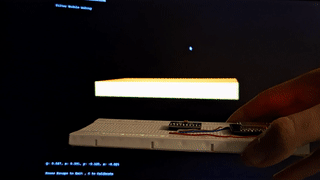

# Dead-reckoning with MARG/IMU

## Introduction

This project focuses on utilizing a MARG/IMU sensor to estimate the position of a pedestrian through Pedestrian Dead Reckoning (PDR) techniques. Acceleration data is utilized to calculate step lengths, interpolate new positions based on heading in the horizontal plane, and mitigate integration error buildup.

## Hardware

The chosen sensor is the [MPU-9250 9-DoF Accel, Gyro, and Magnetometer Sensor](https://invensense.tdk.com/products/motion-tracking/9-axis/mpu-9250/) connected to an [ESP32-WROOM-32](https://www.espressif.com/en/products/devkits/esp32-devkitc). The ESP32 transmits sensor data to a UDP server running the AHRS and EKF algorithms.

## Software

### ESP32:

Operates as a UDPAsync client, sending batch results broadcasted across the network. Parameters such as port, batch size, and sample rate are adjustable through `UDP_PORT`, `packet_div`, and `imu.ConfigSrd(0)` respectively. Default settings are port 1234, a batch size of 20, and a sample rate of 1KHz.

### AHRS - Attitude and Heading Reference System:

Operates as a UDP server, receiving packets from the ESP32 and estimating the sensor's orientation using algorithms such as [Madgwick](https://x-io.co.uk/open-source-imu-and-ahrs-algorithms/), [Mahony](https://ahrs.readthedocs.io/en/latest/filters/mahony.html), or [Extended Kalman Filter (EKF)](https://ahrs.readthedocs.io/en/latest/filters/ekf.html).

### ZUPT - Zero Velocity Update Potential:

Utilized for zero velocity detection to refine position estimates. Customizable parameters include:

- `zupt_thresh`: Threshold for zero velocity detection.
- `margin`: Additional margin added after thresholding.
- `debug`: Output debug information.
- `lp_filter`: Enable/disable low-pass filtering.

### PDR - Pedestrian Dead Reckoning:

Estimates current position relative to the starting position through double integration of acceleration. This implementation includes multiple customizable parameters:

- `filter`: Choice of filtering algorithm (e.g., Mahony, Madgwick, EKF).
- `frequency`: Sampling frequency of the sensor.
- `lp`: Enable/disable live low-pass filtering.
- `cutoff`: Cut-off frequency for filtering.
- `order`: Order of the filter.
- `port`: UDP port for communication.
- `latitude` and `longitude`: Coordinates for automatic magnetic declination and gravity/magnetic field normalization.
- Filter parameters and other configurations can be adjusted during runtime.

### ML - Machine Learning

#### Architecture:

The machine learning component utilizes a neural network architecture consisting of:

- 2 convolutional layers per channel with 6 to 9 max channels.
- Max pooling layer.
- Bidirectional LSTM with 2 layers and dropout of 0.25.
- Final linear layer to output 7 values (3 for positional change, 4 for quaternion rotation).

#### Training:

Training for the 6 degrees of freedom (6dof) model involves using only the IMU data, while training for the 9 degrees of freedom (9dof) model incorporates both IMU and magnetometer data. Training can be performed using the provided script `nn/training/train.py`. Adjustments to the architecture and training parameters can be made in this script.

#### Pretrained Models:

Two pretrained models are provided:

- `6dof.hdf5`: Trained model using only IMU data.
- `9dof.hdf5`: Trained model using IMU and magnetometer data.

These models are located in the `nn/pretrained` directory.

#### Using Models:

The pretrained models can be utilized and executed from either `nn/debug/debug.ipynb` or `nn/training/test.py`, with supplemented arguments.

#### Training Dataset:

The models were trained using a subset of the Oxford Inertial Odometry Dataset (OXIOD), specifically the handheld part, which captures diverse motion patterns of handheld operation. This dataset includes motions such as walking, running, and various indoor activities, providing a comprehensive basis for comparison with ZUPT.

#### Calibration:

The calibration process involves holding the board stationary and pressing "C" to calibrate gyro/acceleration. Pressing "D" records data and formats it to be acceptable for magnetometer calibration, stored in the calib folder. Ensure to input the magnetic declination for accurate heading.

#### Results:

Negligible drift in heading observed during stationary transmission and over 5 minutes of walking in an enclosed environment.
